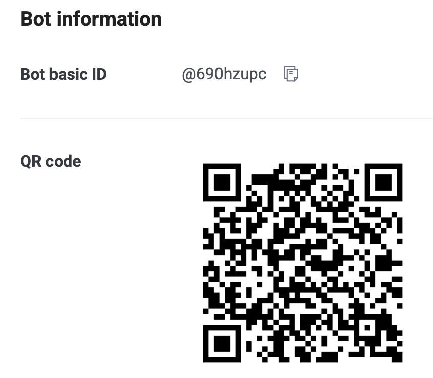
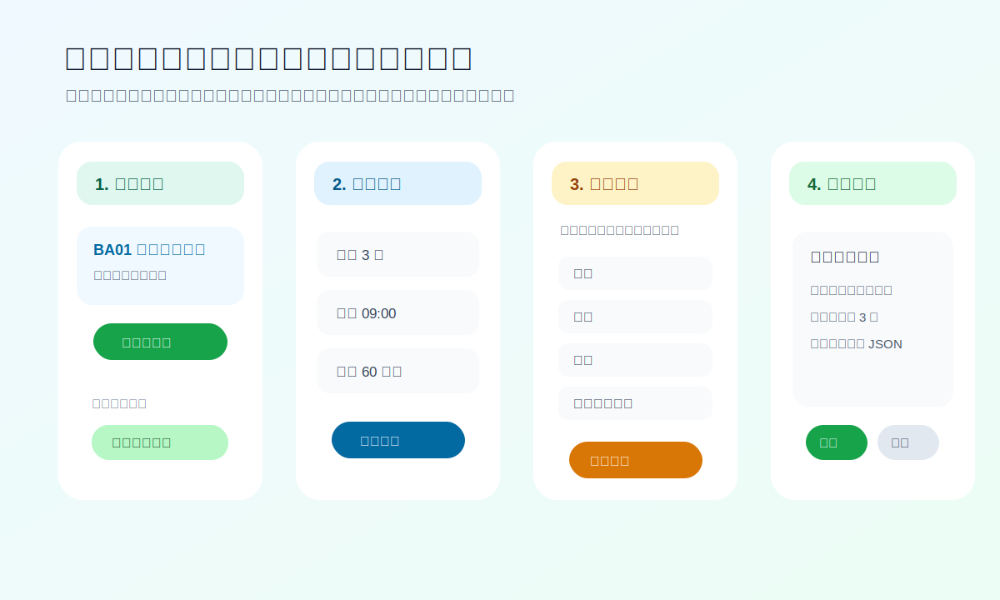
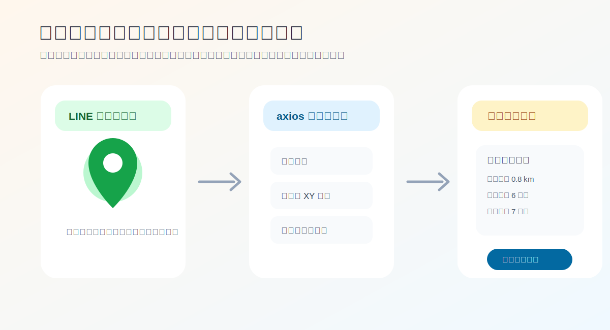
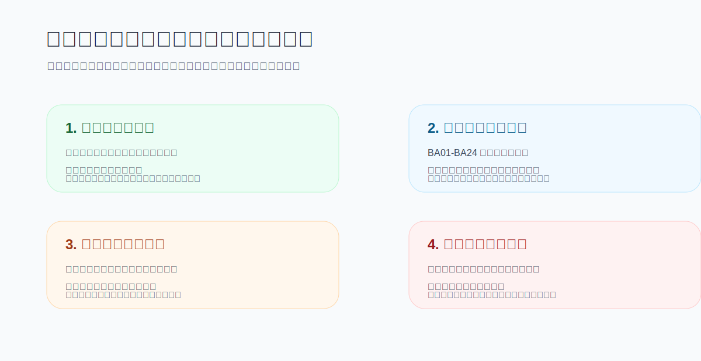
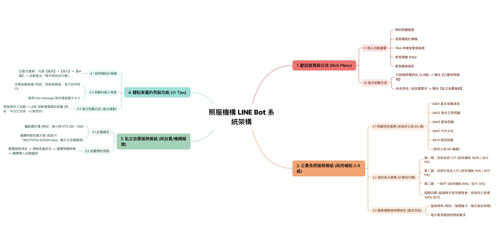

# 居家照服 LINE Bot

把「家裡突然需要照顧服務時，家屬會不知道先做什麼」這件事，整理成一個可以在 LINE 裡一步一步操作的機器人。

一開始我想做很多功能，但後來發現長照使用者最需要的不是炫技，而是清楚、安定、不要讓人緊張。所以這個 Bot 的方向是：先讓家屬知道可以怎麼開始，再慢慢完成預約、補助試算、找附近機構與留下紀錄。

## 加入 LINE Bot

| Bot basic ID | QR code |
| --- | --- |
| **@690hzupc** 用 LINE 搜尋 ID，或掃右邊 QR code 加入。 |  |

## 我想解決的問題

長照資訊其實很多，可是家屬第一次遇到時通常會卡在三件事：

1. 不確定自己家人的身分可以補助多少。
2. 不知道 BA01、BA02 這些服務代碼實際上是什麼。
3. 想預約服務，但資料常常散在聊天紀錄裡，後續不好整理。

所以我把 LINE Bot 設計成「先選照顧項目，再排時間，最後才填資料」的順序。這比較接近生活情境，也比較不會一開始就把使用者丟進表單。

## 操作流程紀錄

### 預約照顧服務

預約的流程我刻意拆成四段：選服務、選固定班表、填聯絡資料、確認預約。  
這樣做的原因是，家屬在 LINE 裡比較像聊天，不像在填後台系統；每一步只問一件事，錯了也比較容易回頭修改。

### 查詢附近機構

附近機構查詢會請使用者分享位置，系統再用經緯度計算距離，並回傳機構名稱、地址、電話、特約服務項目，以及估算的開車與騎車時間。

我希望這個功能看起來不是單純查資料，而是幫家屬把「哪一間比較近、能不能聯絡、提供什麼服務」整理成可以馬上判斷的資訊。

### 心智圖到系統模組

原本的心智圖我保留在專案裡，因為它是這個 Bot 的起點。後來我把右半邊整理成比較能展示的幾個模組：首頁分流、公費長照服務、私立自費服務、管理紀錄。

## 目前完成的功能

- 歡迎首頁與第一次使用提醒
- BA01-BA24 照顧項目選擇
- 固定班表排定
- LINE 內逐步填寫預約資料
- 取消預約並留下紀錄
- 長照補助試算
- 福利身分與自付比例說明
- 1966 申請指南與常見問題
- 緊急聯絡資訊
- 分享位置查詢附近機構
- 管理者查看資料表
- 匯出 CSV 給 Excel 開啟

## 這次製作後的心得

我原本以為 LINE Bot 只是「收到文字、回覆文字」，但做長照題目後才發現，真正重要的是流程順序。  
如果一開始就叫使用者填姓名、電話、地址，會很像冷冰冰的表單；但如果先讓他選照顧項目，再安排時間，最後才留下資料，就比較像有人陪他把事情整理完。

這也是我這份專題想呈現的重點：不是只有機器人回覆，而是把長照服務變成比較容易開始的一條路。
